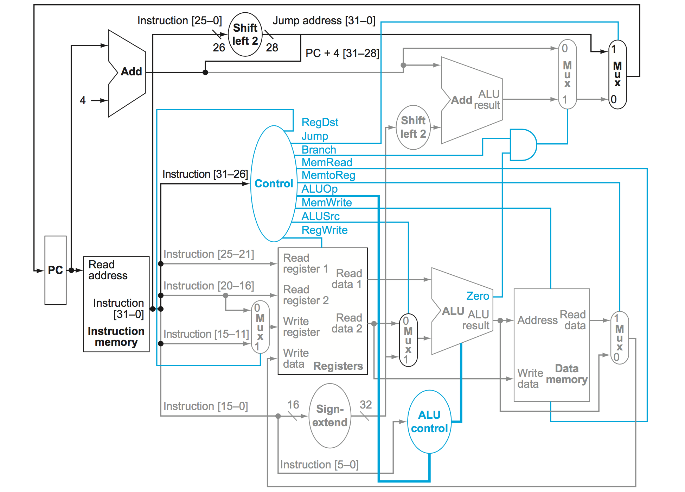
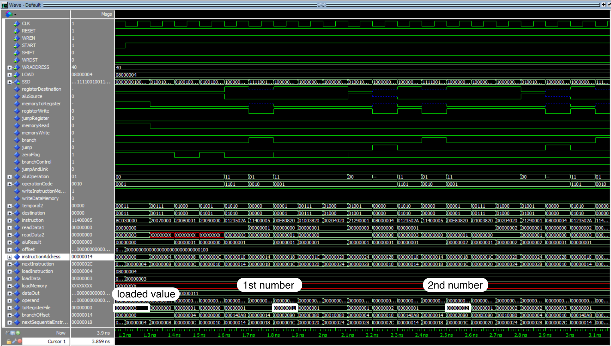
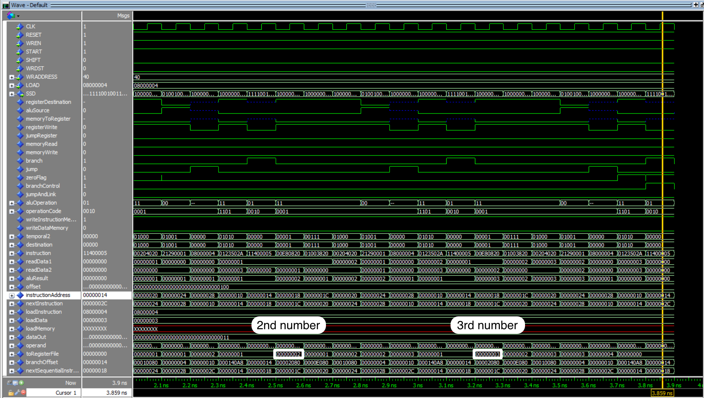

# Objective

The main objective of this laboratory assignment is the design of a single cycle CPU based on the MIPS architecture. To accomplish this goal, the student needs to apply the knowledge acquired throughout the semester regarding the design and implementation of combinational and sequential digital circuits. This laboratory also requires a solid understanding of the MIPS architecture and instruction set architecture, since the CPU model to follow is heavily based on a minimal MIPS blueprint which implements a set of the core instructions from the architecture. Additionally, this assignment also needs the student to have expertise on a hardware description language like VHDL, and to know how to use computer aid design tools such as ModelSim and Quartus II. As a personal goal, we expect to design an implementation capable of executing a recursive function like factorial.

# Design and Implementation

The single cycle CPU we have designed is comprised of nine primary units that we will describe in detail individually. These units, which are shown in figure 1, are: program counter, instruction memory, register file, ALU, data memory, control unit, ALU control unit, 32-bit adder, and multiplexers. The multiple datapaths presented in figure 1 allow the realization of most of the instructions we implemented. In order to implement some instructions such as _jump register_ (jr) and _jump-and-link_ (jal), however, additional circuity is required. Now, we turn our attention to each of the afore mentioned units.  

*Figure 1 - MIPS simple single cycle CPU blueprint.*

## Program Counter

The program counter is simply a 32-bit wide register which stores the address of the instruction currently being executed. It plays an important role in the instruction fetching phase, since it provides the address needed to fetch an instruction from the instruction memory. Because the instructions being fetched must be available at the start of every clock cycle, which we assume occurs after the falling edge of the clock, our program counter is _negative edge-triggered_; the contents of a negative edge-triggered state element can only be updated when the clock signal transitions from high to low.

## Instruction Memory

Unlike the program counter, the instruction memory - and all other memory elements we discuss - is _positive edge-triggered_. The content of a positive edge-triggered state element is always updated when the clock signal transitions from low to high (rising edge of the clock). For our purposes, our instruction memory is _dual ported_, meaning that it has two separate address ports. The first port is used to read from the device, while the second is used to write to it. From now on, we refer to these as RP (read port) and WP (write port). In our CPU design, the RP input of the instruction memory is connected to the output of the program counter. This allows the CPU to fetch an instruction from memory at the beginning of every clock cycle. Port WP, on the other hand, is used exclusively by us to write instructions to memory. 

## Register File

The register file is also a positive edge-triggered state element. This memory element is composed of 32 32-bit wide registers, which can be access by a 5-bit address; each register is identified with a number between 0 and 31 inclusive. Table 1 lists all of the available registers, describing the purpose of each one. From the table, only registers $zero, $lo, $hi, and $sp, are non-writable. Since registers $zero and $sp hold constant values (in our design, $sp stores value 0xFC because the size of our data memory is 256x8), these were designed so that they could never be modified. In the case of registers $lo and $hi, we decided to make them not writable because these two are used to save the 64-bit result of a multiply operation or the quotient and remainder of a divide operation.    

Because all of the MIPS R-type instructions specify three register operands - two source registers (RS and RT) plus a destination register (RD) -, our register file is _triple-ported_. Two of the ports are used to specify two read addresses, while the remaining one is used to provide a single write address. As a result, the register file has two dedicated buses to output the contents of the two registers identified by RS and RT, and a bus input signal to supply the 32-bit value to be written to the register indicated by RD. Additionally, input signal RegWrite, whose value is produced by the control unit at all times, determines when the register file becomes writable.    

| Name       | Register  | Usage                                               | Preserved on Call? |
|:----------:|:---------:|:---------------------------------------------------:|:------------------:|
| $zero      | $0        | constant value 0                                    | n.a.               |
| $v0 - $v1  | $1 - $2   | return value registers                              | no                 |
| $a0 - $a3  | $3 - $6   | arguments                                           | yes                |
| $t0 - $t7  | $7 - $14  | temporaries                                         | no                 |
| $s0 - $7   | $15 - $22 | saved                                               | yes                |
| $t8 - $t11 | $23 - $26 | more temporaries                                    | no                 |
| $lo        | $27       | lower 4 bytes of multiplication result / quotient   | no                 |
| $hi        | $28       | higher 4 bytes of multiplication result / remainder | no                 |
| $sp        | $29       | constant stack base address                         | yes                |
| $fp        | $30       | frame pointer                                       | yes                |
| $ra        | $31       | return address                                      | yes                |
*Table 1 - Register convention.*

## Arithmetic Logical Unit (ALU)

The arithmetic logical unit operates on 32-bit integer values, and is capable of computing the following operations: addition, subtraction, multiplication, division, set on less than, bitwise AND, bitwise OR, bitwise NOR, bitwise XOR, left and right logical shifts, and left and right rotations. The two operands, which we call X and Y, are assumed to be in two's complement form. With the exception of the shifts and rotates, all of these operations are ternary, meaning they require three operands (i.e. fields RS, RT, and RD from the R-format). Just like the MIPS instruction set, we replaced the NOT operation with NOR, to keep with the three-operand format. Thus, if we ever need to complement a value we use NOR with the register of interest and the zero register ($zero). The operation of the ALU is controlled with a 4-bit opcode generated by the ALU control unit. Table 2 lists all the possible opcodes and the operations to which they map to.

| OPCODE | Operation           |
|:------:|:-------------------:|
| 0000   | -                   |
| 0001   | addition            |
| 0010   | subtraction         |
| 0011   | multiplication      |
| 0100   | division            |
| 0101   | bitwise AND         |
| 0110   | bitwise OR          |
| 0111   | bitwise NOR         |
| 1000   | bitwise XOR         |
| 1001   | shift left logical  |
| 1010   | shift right logical |
| 1011   | rotate left         |
| 1100   | rotate right        |
| 1101   | set on less than    |
| 1110   | -                   |
| 1111   | -                   |
*Table 2 - ALU opcodes and operations.* 

In addition to the 32-bit result output, the ALU also contains an output signal to indicate whether the result of an operation is zero. This signal will be used to implement the _branch on equal_ instruction (beq), which subtracts two registers to test for equality. Also, output buses LO and HI store in registers $lo and $hi the 64-bit result of multiplication or the quotient and remainder of division.

## Data Memory

Just like the instruction memory and the register file, the data memory can only be written at the rising edge of the clock signal. Control signals MemWrite and MemRead, whose values are generated by the control unit, are used to manage this state element which only has a single port for both read and write operations. At any given time, only one of these two control signals can be asserted. In figure 1, the address port of this memory is connected to the output of the ALU. In our implementation, however, a multiplexer is utilized to control the source of the port, which can come from either the ALU or from the switches on the DE2 board.   

## Control Unit

The main control unit depicted in figure 1 takes as input the most significant six bits of the 32-bit instruction output by the instruction memory. In the various formats in the MIPS instruction set, this part of the instruction corresponds to the OPCODE field; this field specifies the type of operation encoded in an instruction. As outputs, the circuit has multiple control lines that supervise the operation of the distinct components in the CPU. Table 3 lists such signals and the state each take depending on the value of the OPCODE field; the operations corresponding to each OPCODE value are listed in table 5.   
  
| OPCODE | RegDst | ALUSrc | MemtoReg | RegWrite | MemRead | MemWrite | Branch | Jump | JPLink | JumpRst | ALUOp |
|:------:|:------:|:------:|:--------:|:--------:|:-------:|:--------:|:------:|:----:|:------:|:-------:|:-----:|
| 0h     | 1      | 0      | 0        | 1        | 0       | 0        | 0      | 0    | 0      | 0       | 11    |
| 23h    | 0      | 1      | 1        | 1        | 1       | 0        | 0      | 0    | 0      | 0       | 00    |
| 2Bh    | -      | 1      | -        | 0        | 0       | 1        | 0      | 0    | 0      | 0       | 00    |
| 4h     | -      | 0      | -        | 0        | 0       | 0        | 1      | 0    | 0      | 0       | 01    |
| 2h     | -      | -      | -        | 0        | 0       | 0        | 0      | 1    | 0      | 0       | --    |
| 8h     | 0      | 1      | 0        | 1        | 0       | 0        | 0      | 0    | 0      | 0       | 00    |
| Ah     | 0      | 1      | 0        | 1        | 0       | 0        | 0      | 0    | 0      | 0       | 10    |
| 3h     | -      | -      | -        | 1        | 0       | 0        | 0      | 1    | 1      | 0       | --    |
| 6h     | -      | -      | -        | 0        | 0       | 0        | 0      | 0    | 0      | 1       | --    |
| -      | -      | -      | -        | 0        | 0       | 0        | 0      | 0    | 0      | 0       | --    |
*Table 3 - Settings of control lines according to the value of OPCODE fields.*

## ALU control Unit

To improve performance and ease debugging in our CPU design, we decided to create a separate control unit for the ALU. The inputs to this unit are the FUNCT field of the instruction, which correspond to the least significant six bits, and the 2-bit ALUOp output from the main control unit. The 4-bit output line (Code) is completely determined by these two signals. Table 4 shows the mapping from ALUOp and FUNCT to Code, and names the operation each Code value represents.   

| ALUOp | FUNCT | Code | Operation           |
|:-----:|:-----:|:----:|:-------------------:|
| 00    | -     | 0001 | addition            |
| 01    | -     | 0010 | subtraction         |
| 10    | -     | 1101 | set on less than    |
| 11    | 20h   | 0001 | addition            |
| 11    | 22h   | 0010 | subtraction         |
| 11    | 18h   | 0011 | multiplication      |
| 11    | 1Ah   | 0100 | division            |
| 11    | 24h   | 0101 | bitwise AND         |
| 11    | 25h   | 0110 | bitwise OR          |
| 11    | 27h   | 0111 | bitwise NOR         |
| 11    | 26h   | 1000 | bitwise XOR         |
| 11    | 00h   | 1001 | shift left logical  |
| 11    | 02h   | 1010 | shift right logical |
| 11    | 04h   | 1011 | rotate left         |
| 11    | 06h   | 1100 | rotate right        |
| 11    | 2Ah   | 1101 | set on less than    |
*Table 4 - Truth table for ALU control unit.*

## 32-bit Adder

This circuit is simply an adder that computes the sum of two 32-bit operands. In our CPU implementation, a total of two adders are used. The first computes the _next sequential instruction address_ by adding four to the address stored in the program counter. The second, on the other hand, computes the _branch target address_, which is found by adding the next sequential instruction address (PC + 4) to the signed extended 16-bit immediate field from the instruction shifted two positions to the left. These adders do not have any outputs other than the 32-bit result bus.     

## Multiplexers

In our implementation, we make use of several multiplexers to select among the various outputs produced by the different components integrating the CPU. To choose a destination register in the register file, for example, a 5-bit wide 2 to 1 multiplexer is employed to select between the RD and RT fields of an instruction. The selection process is controlled by control line RegDst. In this particular case, RegDst is asserted whenever an instruction is of the R-format, and deasserted when an instruction is of the I-format. One more type of multiplexer, a 32-bit wide 2 to 1 multiplexer, is also used across our implementation. For instance, one is utilized to select the second operand to the ALU; the two choices are the second register specified by field RT and the signed extended 16-bit immediate from the instruction.        

Table 5 below lists the 21 MIPS instructions we implemented in our CPU design. Whenever we could, we tried to keep with the original MIPS instruction set. A notable exception in this table is instruction jump register or jr, which makes an unconditional jump to the address stored in the specified register. For simplicity, we changed the format of this instruction, from R-type to I-type, and assigned to it OPCODE 06h. The VHDL code for all of the components we have discussed, plus the implementation of the single cycle CPU, is given in the appendix.     

| Instruction Name        | Mnemonic | Format | OPCODE | FUNCT |
|:-----------------------:|:--------:|:------:|:------:|:-----:|
| addition                | add      | R      | 0      | 20h   |
| immediate addition      | addi     | I      | 08h    | -     |
| subtraction             | sub      | R      | 0      | 22h   |
| multiplication          | mult     | R      | 0      | 18h   |
| division                | div      | R      | 0      | 1Ah   |
| bitwise AND             | and      | R      | 0      | 24h   |
| bitwise OR              | or       | R      | 0      | 25h   |
| bitwise NOR             | nor      | R      | 0      | 27h   |
| bitwise XOR             | xor      | R      | 0      | 26h   |
| shift left logical      | sll      | R      | 0      | 00h   |
| shift right logical     | srl      | R      | 0      | 02h   |
| rotate left             | rol      | R      | 0      | 04h   |
| rotate right            | ror      | R      | 0      | 06h   |
| set on less than        | slt      | R      | 0      | 2Ah   |
| set less than immediate | slti     | I      | 0Ah    | -     |
| load word               | lw       | I      | 23h    | -     |
| store word              | sw       | I      | 2Bh    | -     |
| branch on equal         | beq      | I      | 04h    | -     |
| jump                    | j        | J      | 02h    | -     |
| jump register           | jr       | I      | 06h    | -     |
| jump and link           | jal      | J      | 03h    | -     |
*Table 5 - Instruction set.*

# Simulation

Figures 2 and 3 illustrate the simulation of the Fibonacci program given in the appendix. For this simulation the CPU computes the third Fibonacci number, which happens to be (according to the implementation of the program) 3. The program starts by first loading the value 3 from data memory, and placing it in register $r3. After that, it assigns the values 0 and 1 to registers $r7 and $r8, respectively. The assignment process is performed through the use of instruction addi, in which one of the operands is the zero register $r0. Register $r9 is then used as the index variable for the loop. The loop consists of a beq and j instructions. In each iteration of the loop, registers $r7 and $r8 are added with instruction add, and the sum is stored in register $r1 (a return value register). After the sum, $r7 gets the value of $r8, and $r8 gets the value stored in $r1. Finally, we increment our index register $r9. This process executes exactly three times, and the return value is placed in $r1. 

*Figure 2 - Simulating Fibonacci program (part 1).*

*Figure 3 - Simulating Fibonacci program (part 2).*

# Demonstration

To demonstrate the operation of the CPU, we have written and tested two separate programs. The first program computes Fibonacci numbers by using a for loop. This program assumes that we exclude the first two numbers in the Fibonacci sequence, which are 0 and 1. Figure 4 shows the output obtained after the program is run. The second program is a recursive factorial function, capable of calculating the factorial of numbers no greater than 12. In figure 5 we show the output produced by the CPU for 8!. The MIPS assembly code, as well as the equivalent machine code, is included in the appendix.    

*Figure 4 - 22h (34 in base 10) is the 8th Fibonacci number.*

*Figure 5 - 9D80h (40320 in base 10) is 8!.*

# Conclusion

As a result of this exercise we have designed a very simple single cycle CPU based on the MIPS architecture. To accomplish this goal, we have applied the knowledge we acquired throughout the semester about the design and development of combinational and sequential digital circuits. Understanding the operation of each individual component in the CPU, and how they relate in multiple datapaths, was an essential ingredient that allowed us to complete this assignment. The use of VHDL and computerized aided design tools such as ModelSim, and Quartus II, greatly simplified the task at hand. Along the way, we faced many dilemmas, where we had to compromise on some aspects of our implementation in order to move forward. Our decisions, nevertheless, were appropriate and they permitted us to complete a CPU design capable of executing recursive functions.    

